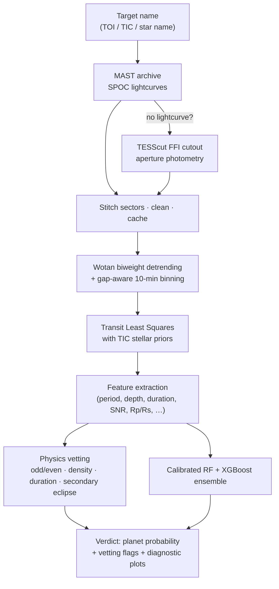
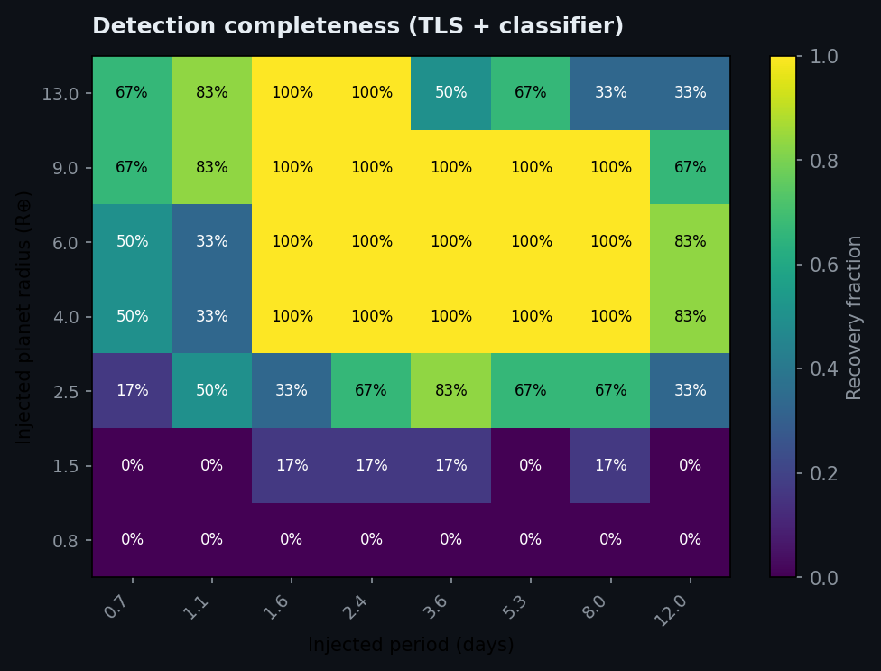
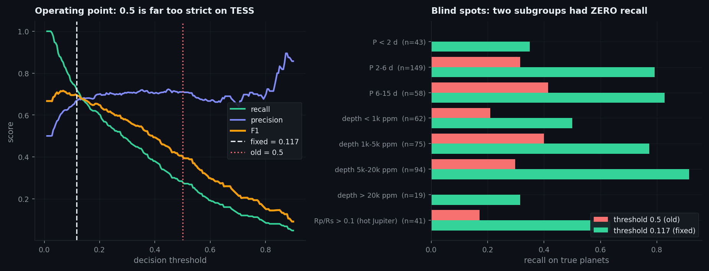
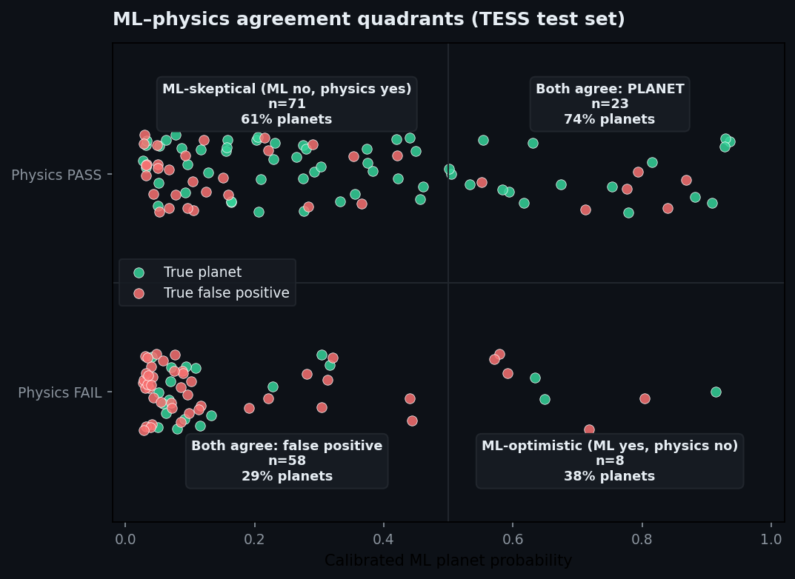
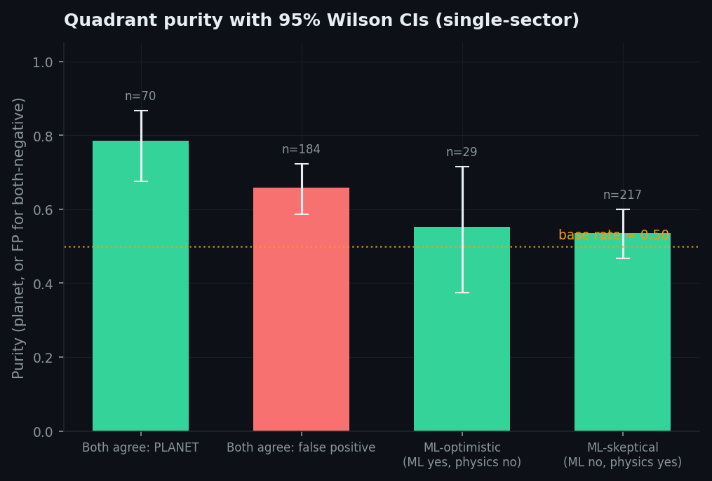
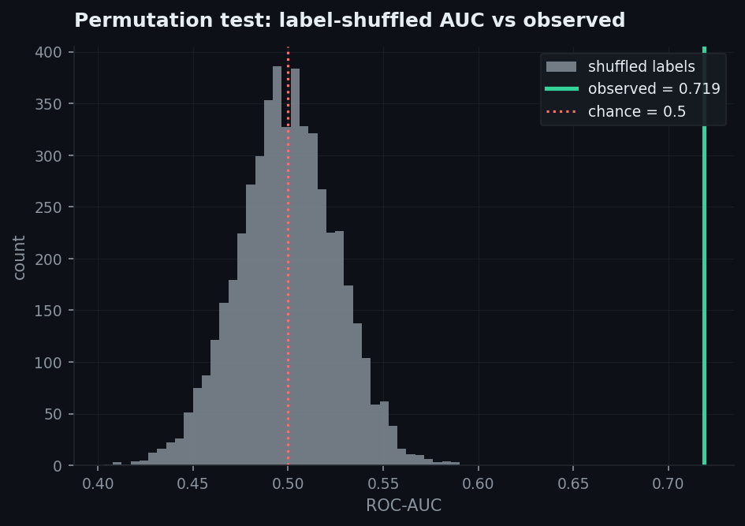

<div align="center">

# 🪐 Exoplanet Detection Pipeline

**A physics-informed machine learning pipeline that hunts for transiting exoplanets in real TESS data — from raw photometry to a vetted, calibrated verdict.**


📄 **[Read the paper (PDF)](paper/paper.pdf)** — *How Well Does a Kepler-Trained Transit Classifier Transfer to TESS? A Characterization Study*


*TOI-270 c recovered by the pipeline: a 3,732 ppm transit at P = 5.6604 d (SDE ≈ 40), with the TLS model overlaid.*

</div>

---

## What it does

Give it any TESS target (`TOI-270`, `TIC 307210830`, …) and the pipeline will:

1. **Fetch** SPOC lightcurves from the MAST archive (stitching up to 3 sectors, cached on disk) — and if the star has no processed lightcurve, fall back to extracting photometry directly from **Full Frame Images** via TESScut.
2. **Detrend** stellar variability with a `wotan` biweight filter and apply gap-aware 10-minute median binning.
3. **Search** for periodic transits with **Transit Least Squares (TLS)**, using stellar radius/mass priors pulled live from the TIC catalog.
4. **Vet** the signal with physics: signal detection efficiency, odd/even depth consistency (Welch's t-test), transit duration vs. the circular-orbit maximum, transit-implied stellar density vs. the catalog star, and a secondary-eclipse search at phase 0.5.
5. **Classify** the candidate with a **calibrated RandomForest + XGBoost ensemble** trained on real NASA dispositions, returning a well-calibrated planet probability.
6. **Explain** every verdict with a plain-English reasoning trail — data provenance, signal statistics, the outcome of each physics check, and the ML score — so you always know *why* a target was accepted or rejected.

## Model results

The classifier is trained on the **NASA Exoplanet Archive KOI cumulative catalog** — 7,325 Kepler objects of interest with definitive labels (2,745 `CONFIRMED` planets vs. 4,580 `FALSE POSITIVE`s; `CANDIDATE`s excluded). All numbers below are from a **held-out 20% test set** (n = 1,465) never seen during training or calibration.

| Metric | Score |
| :--- | :--- |
| Accuracy | **89.8%** |
| ROC-AUC | **0.957** |
| PR-AUC (average precision) | **0.917** |
| Precision (planet class) | 0.832 |
| Recall (planet class) | 0.911 |
| F1 (planet class) | 0.870 |
| Brier score (calibration) | 0.080 |
| 5-fold CV ROC-AUC | 0.964 ± 0.006 |

| | |
| :---: | :---: |
|  |  |
|  |  |
|  |  |

**Training protocol.** 64% fit / 16% calibration / 20% test stratified split. The soft-voting ensemble (RandomForest, 300 trees + XGBoost, 400 trees) is fit on the fit split only; probabilities are then Platt-calibrated on the untouched calibration split; metrics are reported on the untouched test split. Permutation importance shows the model leans on physically meaningful features — `rp_rs` (planet/star radius ratio), `duration_over_period`, and `model_snr` — not artifacts.

Retrain from scratch (downloads the labeled catalog automatically, trains in under a minute on a laptop):

```bash
python train_model.py            # add --refresh-data to force a fresh catalog download
```

## Pipeline in action

Real output for TOI-270 (M-dwarf multi-planet system), produced by [`main.ipynb`](main.ipynb):


```text
Verdict reasoning:
  - Host star: R = 0.37 R☉, M = 0.36 M☉ (TIC catalog).
  - Best periodic signal: P = 5.6604 d, depth = 3732 ppm, duration = 1.42 h, Rp/Rs = 0.0549.
  - Signal strength: SDE = 39.6 ≥ 7 — the periodic dip is statistically significant.
  - Implied companion radius: 0.20 R_Jup (within the planetary regime).
  - Odd/even test: alternating transits have consistent depths (Welch p = 0.212).
  - Duration check: transit lasts 0.83× the circular-orbit maximum — physically plausible.
  - Density check: transit-implied stellar density is 1.72× the catalog value — consistent.
  - Secondary eclipse: none found at phase 0.5 (S/N = -1.9 < 3).
  - ML classifier: calibrated ensemble assigns a 82.9% planet probability.
  - VERDICT: PLANET CANDIDATE — all 5 physics checks pass and the ML probability is 82.9%.
```

### Blind tests on targets the pipeline had never seen

| Target | Ground truth | Pipeline result |
| :--- | :--- | :--- |
| π Mensae | π Men c: P = 6.2679 d, ~300 ppm super-Earth | Recovered at **P = 6.2670 d**, 232 ppm → planet candidate, **90.1%** |
| Ross 176 | TOI-4491.01, confirmed planet, P = 5.006622 d | Recovered at **P = 5.0065 d** → planet candidate, 68.5% |
| WASP-121 | Ultra-hot Jupiter, P = 1.27494 d | Recovered at **P = 1.2749 d**; all physics passes (its real ~360 ppm dayside emission is correctly attributed to the planet, not a stellar companion); verdict AMBIGUOUS — deep, short-period signals are statistically dominated by binaries in the training data, so the ML defers to follow-up |
| TOI-270 | TOI-270 c: P = 5.66057 d | Recovered at **P = 5.6604 d** → planet candidate, 82.9% |

*Fun fact: this repo previously listed Ross 176 as a "no known transits" control star — the rebuilt pipeline found its (real, since-confirmed) planet on the first run.*

## Architecture



Everything scientific lives in **[`pipeline.py`](pipeline.py)** — the Streamlit app, the FastAPI backend, and the notebook are thin clients of the same module, so results are identical everywhere.

### Model features

| Feature | Description |
| :--- | :--- |
| `period_days` | Best-fit orbital period from TLS |
| `depth_ppm` | Transit depth in parts-per-million |
| `duration_hrs` | Transit duration in hours |
| `model_snr` | Signal-to-noise ratio of the transit fit |
| `rp_rs` | Planet-to-star radius ratio |
| `log10_depth`, `log10_period` | Log-scaled depth & period (dynamic-range handling) |
| `duration_over_period` | Duration/period ratio — a density proxy that separates planets from blends |

Feature units are identical between the KOI training catalog and the TLS outputs at inference — no train/serve skew.

### Physics vetting checks

| Check | Rejects |
| :--- | :--- |
| SDE ≥ 7 | Statistical noise |
| Odd/even depth (Welch's t-test **plus** a ≥10 % effect-size guard) | Eclipsing binaries detected at ½ their true period, without false-flagging negligible differences on 10⁵-point lightcurves |
| Duration ≤ 1.5× circular-orbit maximum | Physically impossible transits |
| Transit-implied stellar density within [0.1, 30]× catalog | Blended / background eclipsing binaries |
| No *binary-like* secondary eclipse (S/N ≥ 3 **and** depth ≥ 15 % of primary) | Stellar companions — while correctly tolerating genuine planetary dayside emission (e.g. WASP-121 b) |

## Quickstart

```bash
git clone <repo-url> && cd expoplanet_detection
python3.12 -m venv .venv && source .venv/bin/activate
pip install -r requirements.txt
```

**Streamlit dashboard** (single command, everything included):

```bash
streamlit run app.py             # opens http://localhost:8501
```

**FastAPI + Next.js stack:**

```bash
# Terminal 1 — API
cd backend && uvicorn main:app --reload --port 8000

# Terminal 2 — frontend
cd frontend && npm install && npm run dev    # opens http://localhost:3000
```

**Notebook walkthrough:**

```bash
jupyter notebook main.ipynb
```

> The first analysis of a target downloads its lightcurves from MAST (≈1–2 min). Results are cached in `lc_cache/`, so re-runs take seconds to start and ~1 min for the TLS search.

### Example targets

| Target | What you should see |
| :--- | :--- |
| `TOI-270` | Planet candidate, P ≈ 5.66 d, all vetting checks pass |
| `Pi Mensae` | Shallow 232 ppm super-Earth recovered at P ≈ 6.267 d |
| `TIC 307210830` | L 98-59 — compact multi-planet system |
| `Ross 176` | Finds TOI-4491.01, a confirmed planet at P ≈ 5.0066 d |
| `WASP-121` | Hot Jupiter — physics passes, ML stays skeptical (AMBIGUOUS) |

## Project structure

```text
expoplanet_detection/
├── pipeline.py            # Core science: fetching, detrending, TLS, features, vetting
├── train_model.py         # Trains model v3 on the labeled KOI catalog; writes metrics + figures
├── app.py                 # Streamlit dashboard (UI only — imports pipeline.py)
├── main.ipynb             # Executed walkthrough notebook with real outputs
├── backend/
│   └── main.py            # FastAPI wrapper around pipeline.analyze()
├── frontend/
│   └── app/               # Next.js 16 + Tailwind UI (charts, vetting cards, model view)
├── model/
│   └── exoplanet_model_v3.pkl   # Calibrated RF+XGBoost ensemble (2.8 MB)
├── research/              # Characterization study (see "Research" below)
│   ├── tess_benchmark.py  # Cross-mission benchmark on labeled TESS TOIs
│   ├── injection.py       # Mandel–Agol injection–recovery completeness
│   ├── disagreement.py    # ML×physics disagreement triage analysis
│   ├── baselines.py       # Model comparison + feature/physics ablations
│   ├── cnn_baseline.py    # 1D-CNN shape baseline
│   └── run_all.py         # Reproduce the whole study
├── paper/                 # Preprint: paper.tex + compiled paper.pdf
├── docs/
│   ├── metrics.json       # Held-out test metrics (written by train_model.py)
│   └── img/               # Training, pipeline, and research figures
├── data/                  # KOI training catalog (auto-downloaded, gitignored)
├── lc_cache/              # Cached TESS lightcurves (auto-downloaded, gitignored)
└── requirements.txt
```

## 🔬 Research: characterizing the pipeline

Beyond the working tool, [`research/`](research/) treats the pipeline as a
**characterized, validated decision system** — written up as a paper:
📄 **[paper.pdf](paper/paper.pdf)** (LaTeX source in [`paper/`](paper/)).
The thesis: a detection pipeline should be
reported not as one accuracy number but by *what it can detect*, *how it transfers
across missions*, and *which claims survive a larger sample and a validation
battery*. Every number below is on a **500-target labeled TESS benchmark** with
bootstrap/Wilson confidence intervals. Reproduce everything with
`python -m research.run_all`.

**1 · Injection–recovery completeness.** Injecting `batman` transits into real,
screened-quiet TESS light curves and running the full pipeline maps detection
completeness over period and radius — **0.71 (TLS) and 0.55 (TLS + classifier)**
overall. Recovery is bounded below by the detection floor (0.8 R⊕: 0%; 1.5 R⊕:
8%), toward long periods by having fewer transits per sector (0.69 at 2.4 d →
0.43 at 12 d), and at the top by the classifier correctly *rejecting* the most
giant, EB-like depths (peaks at 0.90 near 9 R⊕, falling to 0.67 at 13 R⊕).



**2 · Honest cross-mission transfer.** A classifier scoring **ROC-AUC 0.96 in
Kepler cross-validation drops to 0.72 (95% CI [0.67, 0.76]) on TESS** (500 TOIs,
CP/KP vs FP/FA), with calibration degrading (Brier 0.08 → 0.29). The ensemble
remains the **best** cross-mission model — it beats a one-parameter SNR cut and
every other learner:

| Model (trained on Kepler, tested on TESS) | ROC-AUC |
| :--- | :---: |
| RF + XGBoost ensemble (ours) | **0.710** |
| Decision tree | 0.655 |
| Logistic regression | 0.642 |
| SDE / SNR threshold (no ML) | 0.641 |
| 1D-CNN (folded views) | 0.641 |
| MLP | 0.552 |

*Why doesn't it transfer?* The depth/radius→label direction **inverts** between
missions: on Kepler deep transits skew toward eclipsing-binary FPs; among these
TESS TOIs the deepest signals are disproportionately *confirmed planets* (both
Mann–Whitney p < 10⁻⁴). A model that learned "deep ⇒ FP" is mis-oriented on TESS.

**3 · The operating point matters more than the model.** Because the transferred
probabilities are compressed toward zero, the textbook **p ≥ 0.5 cut recovers only
28% of real planets** — and is *completely blind* to two subgroups: every planet
with P < 2 d (0/43) and every one deeper than 20,000 ppm (0/19), which are exactly
TESS's most characteristic detections. A cross-validated threshold of **0.117**
(identical in all 5 folds, held-out recall 0.728 ± 0.033) fixes most of it:

| | p ≥ 0.5 (old) | p ≥ 0.117 (fixed) |
| :--- | :---: | :---: |
| Recall | 0.284 | **0.724** |
| Precision | 0.717 | 0.670 |
| F1 | 0.407 | **0.696** |
| Planets found | 71/250 | **181/250** |



Two model-level fixes were tried and **did not work**: dropping the inverting
features (AUC 0.703 → 0.699) and fusing physics flags with the ML score
(ΔAUC +0.005, CI [−0.015, +0.023]). The recoverable gain was in the decision
rule, not the feature set. Reproduce with `python -m research.error_analysis`.

**4 · ML × physics: agreement works, disagreement doesn't (honest result).** The
calibrated ML score and the 5-check physics verdict are *independent*. Crossing
them into four quadrants (n = 500):



**Agreement is strongly predictive:** both-say-planet is **79% pure [0.68, 0.87]**
(a planet is 3.7× more likely than an FP to land there), both-say-FP is planet-depleted,
and physics vetting independently rejects **54% of false positives** (Fisher OR 2.5,
p < 10⁻³). **Disagreement, however, is only marginal:** the "ML-skeptical, physics-pass"
quadrant is just 54% planets [0.47, 0.60] — its interval includes the 50% base rate.
A cleaner-looking 61% at an earlier 160-target sample **did not replicate**, and a
physics-informed follow-up ranking shows **no reliable advantage** over probability
alone at n = 500. We report these negatives honestly — testing your own headline and
saying what survives is the point.



**5 · Validation (not hallucinating).** A [validation battery](research/validate.py)
confirms the results are real: a label-permutation test collapses the AUC to a null
centered at 0.50 with the observed 0.72 far outside (**p = 0**); both verdicts are
significantly associated with truth (Fisher p < 10⁻³); and **350/350** recovered TLS
periods match the independent ExoFOP catalog to <3% (median 0.07%). Kepler (KIC) and
TESS (TIC) target sets are disjoint — no leakage.



> Full method, caveats, and reproduction steps: [`research/README.md`](research/README.md).
> Numbers regenerate from public archives; heavy stages are resumable.

## Honest limitations

- The classifier is trained on **Kepler** statistics and applied to **TESS** TLS fits; the shared, unit-matched feature space makes this transfer reasonable, but it is still a domain shift — quantified honestly in the [research study](research/) (AUC 0.96 → 0.72 [0.67, 0.76]).
- **The cross-mission benchmark uses single-sector light curves** for tractability, which lower-bounds detection; multi-sector stitching would raise completeness (the benchmark's `--max-sectors` flag lifts this).
- **Deep, short-period signals (hot Jupiters) often land in the AMBIGUOUS verdict**: in the labeled training population such signals are mostly eclipsing binaries, so the ML is deliberately conservative there even when physics vetting passes — exactly the case that professionally requires radial-velocity follow-up.
- A "planet candidate" verdict is a screening signal, not a discovery — real candidates require pixel-level vetting, follow-up photometry and radial velocities.
- The TLS search is bounded to periods of 0.5–15 days (≥2 transits required in the observed baseline), so long-period planets are out of scope by design.
- Only the strongest periodic signal per star is reported; additional planets in multi-planet systems would need iterative signal subtraction (not yet implemented).

## Acknowledgements

Built on open data and open source: [NASA Exoplanet Archive](https://exoplanetarchive.ipac.caltech.edu/), [MAST](https://archive.stsci.edu/) / TESS SPOC, [lightkurve](https://docs.lightkurve.org/), [Transit Least Squares](https://github.com/hippke/tls) (Hippke & Heller 2019), [wotan](https://github.com/hippke/wotan), scikit-learn and XGBoost.

*This project is for educational and research purposes.*
