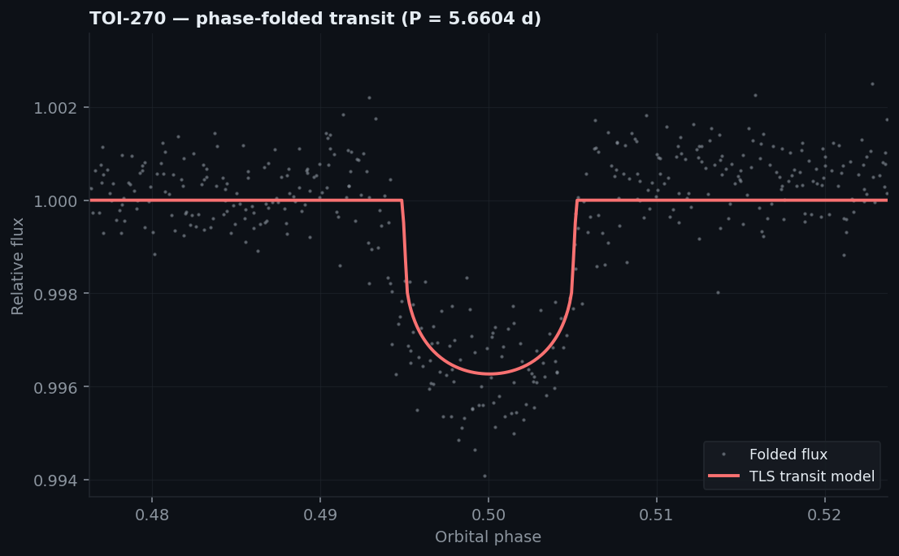
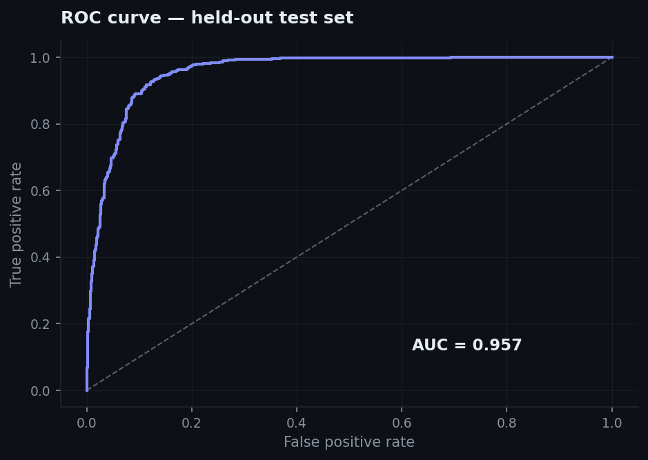
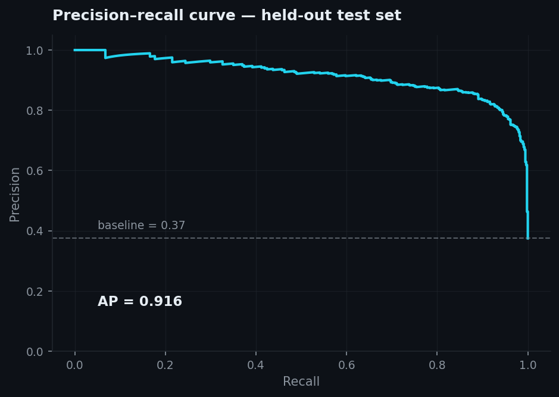
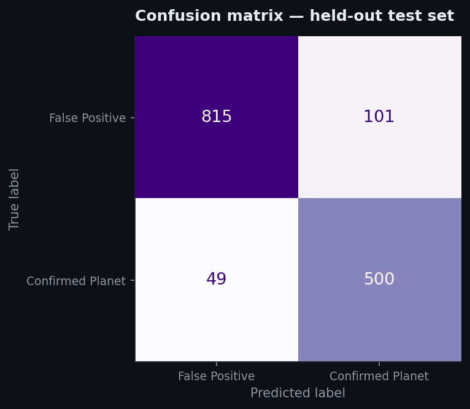
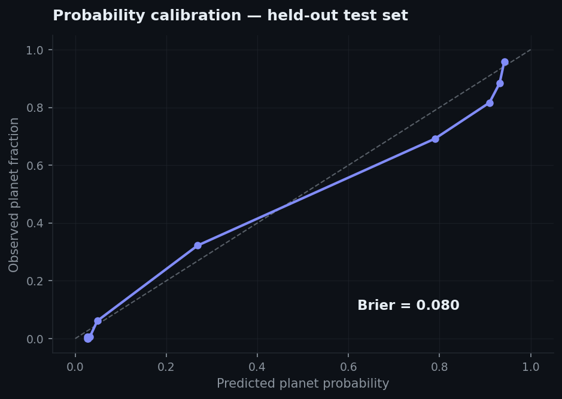
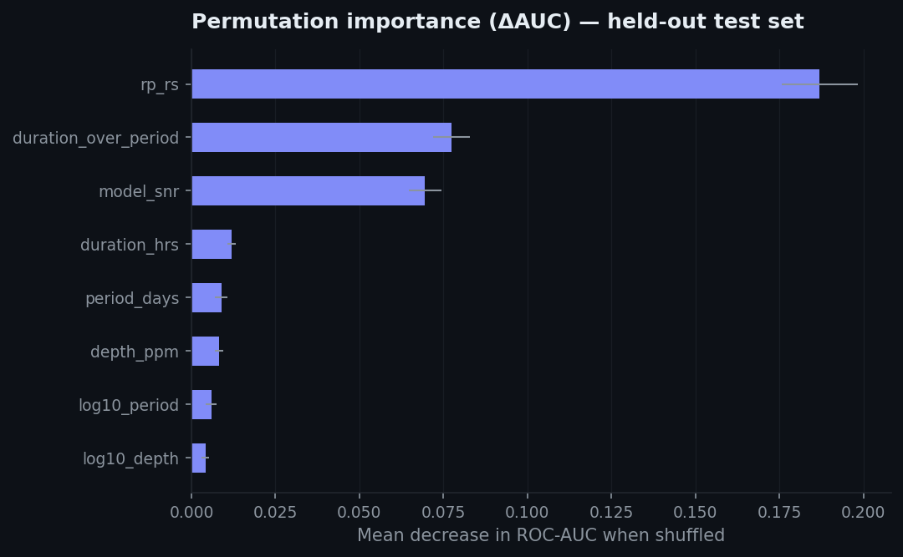
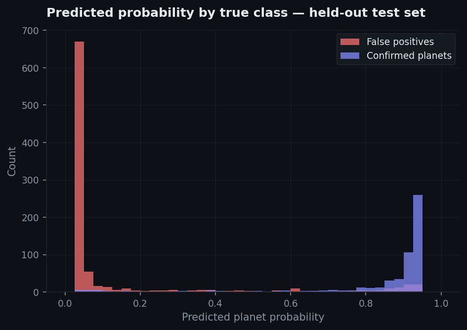
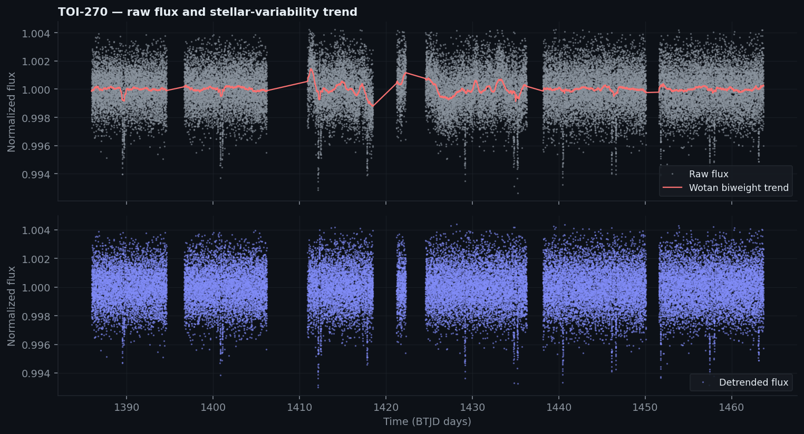
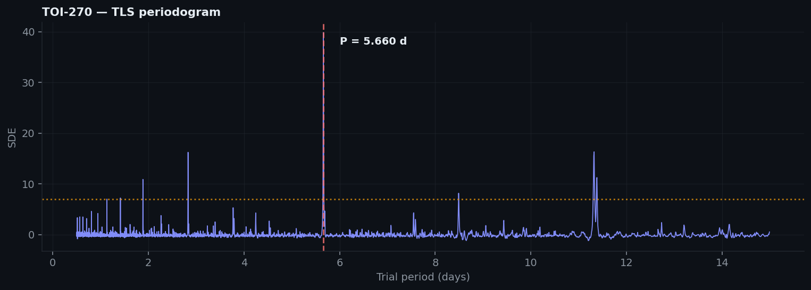
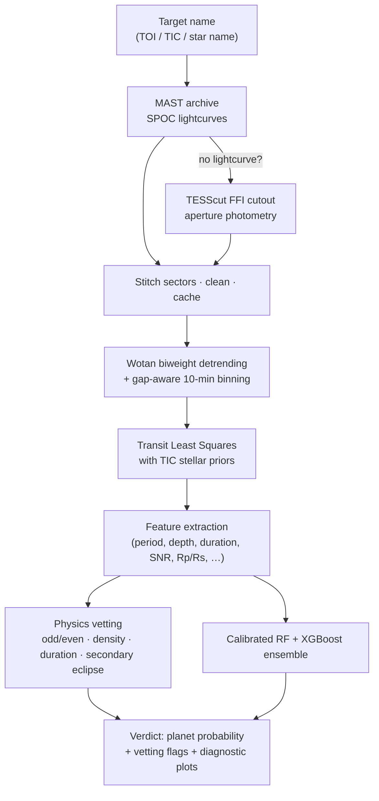

<div align="center">

# 🪐 Exoplanet Detection Pipeline

**A physics-informed machine learning pipeline that hunts for transiting exoplanets in real TESS data — from raw photometry to a vetted, calibrated verdict.**




*TOI-270 c recovered by the pipeline: a 3,732 ppm transit at P = 5.6604 d (SDE ≈ 40), with the TLS model overlaid.*

</div>

---

## What it does

Give it any TESS target (`TOI-270`, `TIC 307210830`, …) and the pipeline will:

1. **Fetch** SPOC lightcurves from the MAST archive (stitching up to 3 sectors, cached on disk) — and if the star has no processed lightcurve, fall back to extracting photometry directly from **Full Frame Images** via TESScut.
2. **Detrend** stellar variability with a `wotan` biweight filter and apply gap-aware 10-minute median binning.
3. **Search** for periodic transits with **Transit Least Squares (TLS)**, using stellar radius/mass priors pulled live from the TIC catalog.
4. **Vet** the signal with physics: signal detection efficiency, odd/even depth consistency (Welch's t-test), transit duration vs. the circular-orbit maximum, transit-implied stellar density vs. the catalog star, and a secondary-eclipse search at phase 0.5.
5. **Classify** the candidate with a **calibrated RandomForest + XGBoost ensemble** trained on real NASA dispositions, returning a well-calibrated planet probability.

## Model results

The classifier is trained on the **NASA Exoplanet Archive KOI cumulative catalog** — 7,325 Kepler objects of interest with definitive labels (2,745 `CONFIRMED` planets vs. 4,580 `FALSE POSITIVE`s; `CANDIDATE`s excluded). All numbers below are from a **held-out 20% test set** (n = 1,465) never seen during training or calibration.

| Metric | Score |
| :--- | :--- |
| Accuracy | **89.8%** |
| ROC-AUC | **0.957** |
| PR-AUC (average precision) | **0.917** |
| Precision (planet class) | 0.832 |
| Recall (planet class) | 0.911 |
| F1 (planet class) | 0.870 |
| Brier score (calibration) | 0.080 |
| 5-fold CV ROC-AUC | 0.964 ± 0.006 |

| | |
| :---: | :---: |
|  |  |
|  |  |
|  |  |

**Training protocol.** 64% fit / 16% calibration / 20% test stratified split. The soft-voting ensemble (RandomForest, 300 trees + XGBoost, 400 trees) is fit on the fit split only; probabilities are then Platt-calibrated on the untouched calibration split; metrics are reported on the untouched test split. Permutation importance shows the model leans on physically meaningful features — `rp_rs` (planet/star radius ratio), `duration_over_period`, and `model_snr` — not artifacts.

Retrain from scratch (downloads the labeled catalog automatically, trains in under a minute on a laptop):

```bash
python train_model.py            # add --refresh-data to force a fresh catalog download
```

## Pipeline in action

Real output for TOI-270 (M-dwarf multi-planet system), produced by [`main.ipynb`](main.ipynb):





```text
Star: R = 0.374 R_sun, M = 0.362 M_sun  (TIC catalog)
Best period: 5.66038 d | duration: 1.29 h | SDE: 39.9

Physics vetting:
  Signal detection (SDE >= 7):    PASS  (SDE = 39.9)
  Odd/even depth (Welch t-test):  PASS  (p = 0.415)
  Duration vs circular maximum:   PASS  (0.76x)
  Stellar density consistency:    PASS  (ratio = 2.29)
  Secondary eclipse at phase 0.5: none  (S/N = -1.7)

==> Planet Candidate Detected  (probability = 84.1%)
```

## Architecture



Everything scientific lives in **[`pipeline.py`](pipeline.py)** — the Streamlit app, the FastAPI backend, and the notebook are thin clients of the same module, so results are identical everywhere.

### Model features

| Feature | Description |
| :--- | :--- |
| `period_days` | Best-fit orbital period from TLS |
| `depth_ppm` | Transit depth in parts-per-million |
| `duration_hrs` | Transit duration in hours |
| `model_snr` | Signal-to-noise ratio of the transit fit |
| `rp_rs` | Planet-to-star radius ratio |
| `log10_depth`, `log10_period` | Log-scaled depth & period (dynamic-range handling) |
| `duration_over_period` | Duration/period ratio — a density proxy that separates planets from blends |

Feature units are identical between the KOI training catalog and the TLS outputs at inference — no train/serve skew.

### Physics vetting checks

| Check | Rejects |
| :--- | :--- |
| SDE ≥ 7 | Statistical noise |
| Odd/even depth (Welch's t-test, p ≥ 0.01) | Eclipsing binaries detected at ½ their true period |
| Duration ≤ 1.5× circular-orbit maximum | Physically impossible transits |
| Transit-implied stellar density within [0.1, 30]× catalog | Blended / background eclipsing binaries |
| No secondary eclipse at phase 0.5 (S/N < 3) | Stellar companions with visible occultations |

## Quickstart

```bash
git clone <repo-url> && cd expoplanet_detection
python3.12 -m venv .venv && source .venv/bin/activate
pip install -r requirements.txt
```

**Streamlit dashboard** (single command, everything included):

```bash
streamlit run app.py             # opens http://localhost:8501
```

**FastAPI + Next.js stack:**

```bash
# Terminal 1 — API
cd backend && uvicorn main:app --reload --port 8000

# Terminal 2 — frontend
cd frontend && npm install && npm run dev    # opens http://localhost:3000
```

**Notebook walkthrough:**

```bash
jupyter notebook main.ipynb
```

> The first analysis of a target downloads its lightcurves from MAST (≈1–2 min). Results are cached in `lc_cache/`, so re-runs take seconds to start and ~1 min for the TLS search.

### Example targets

| Target | What you should see |
| :--- | :--- |
| `TOI-270` | Planet candidate, P ≈ 5.66 d, all vetting checks pass |
| `TIC 307210830` | L 98-59 — compact multi-planet system |
| `TIC 38846515` | Known planet host |
| `Ross 176` | No significant transit signal |

## Project structure

```text
expoplanet_detection/
├── pipeline.py            # Core science: fetching, detrending, TLS, features, vetting
├── train_model.py         # Trains model v3 on the labeled KOI catalog; writes metrics + figures
├── app.py                 # Streamlit dashboard (UI only — imports pipeline.py)
├── main.ipynb             # Executed walkthrough notebook with real outputs
├── backend/
│   └── main.py            # FastAPI wrapper around pipeline.analyze()
├── frontend/
│   └── app/               # Next.js 16 + Tailwind UI (charts, vetting cards, model view)
├── model/
│   └── exoplanet_model_v3.pkl   # Calibrated RF+XGBoost ensemble (2.8 MB)
├── docs/
│   ├── metrics.json       # Held-out test metrics (written by train_model.py)
│   └── img/               # Training + pipeline result figures used above
├── data/                  # KOI training catalog (auto-downloaded, gitignored)
├── lc_cache/              # Cached TESS lightcurves (auto-downloaded, gitignored)
└── requirements.txt
```

## Honest limitations

- The classifier is trained on **Kepler** statistics and applied to **TESS** TLS fits; the shared, unit-matched feature space makes this transfer reasonable, but it is still a domain shift.
- A "planet candidate" verdict is a screening signal, not a discovery — real candidates require pixel-level vetting, follow-up photometry and radial velocities.
- The TLS search is bounded to periods of 0.5–15 days (≥2 transits required in the observed baseline), so long-period planets are out of scope by design.

## Acknowledgements

Built on open data and open source: [NASA Exoplanet Archive](https://exoplanetarchive.ipac.caltech.edu/), [MAST](https://archive.stsci.edu/) / TESS SPOC, [lightkurve](https://docs.lightkurve.org/), [Transit Least Squares](https://github.com/hippke/tls) (Hippke & Heller 2019), [wotan](https://github.com/hippke/wotan), scikit-learn and XGBoost.

*This project is for educational and research purposes.*
